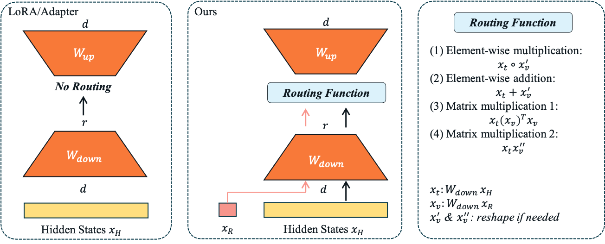

# Routing_VLPEFT
Official code for [Introducing Routing Functions to Vision-Language Parameter-Efficient Fine-Tuning with Low-Rank Bottlenecks](https://arxiv.org/abs/2403.09377) (ECCV2024)

* The main code (ViT+RoBERTa/GPT) for our paper is released.

## Installation
To create conda env, please run:

    conda env create -n routingvl --file environment.yml
    conda activate routingvl

## Data
Please download MSCOCO and VQAv2 datasets and store them under `DATAROOT/MSCOCO` and `DATAROOT/VQAv2` respectively. `DATAROOT` is the root directory for datasets of your choice.

## Training
Before running training scripts, check if you need to modify the dirs for datasets/output in the configs folder

    For dataset: DATAROOT
    For output: OUTPUT_DIR
    The dirs can also be changed in the scripts.

To train ViT+RoBERTa/GPT, (taking ViT+GPT using Adapter for example) please run

    cd scripts
    bash run_vit_gpt_adapter.sh

Specifically,
* change the output dir by changing `--output_dir OUTPUT_DIR`

* change the backbones by changing `--gpt_type gpt2` and `--vit_type google/vit-base-patch16-224-in21k`
    * Note: backbone models with different dimensions for hidden states can also be used, if one changes the model class a bit.

* whether use pooled output from ViT: `--vit_use_pooler`

* determine where to add routing functions: `--merge_type beforeB (or afterB)`

* specificy layers to inject PEFT modules: `--fusion_layer`

* where to use routing functions: `--use_routing`

* changing routing function types:

    `--element_add ($x_t + x'_v$)`

    `--element_mul ($x_t \circ x'_v$)`
    
    `--element_mul_expand ($x_t  x''_v$)`
    
    `--vllora ($x_t (x_v)^T  x_v$)`

* control where to add Adapters: `--adapt_pos`

* only use conventional LoRA: `--all_lora`

* do not use visual prefix to textual input: `--no_vis_prefix`

and more

## Evaluation
Run evaluation on VQAv2:
    
    bash run_vit_roberta_test.sh

Run evaluation on COCO Cap.:

    bash run_vit_gpt_test.sh
    bash eval_coco.sh

Please change the `OUTPUT_DIR` and `--model_name` (name of the saved ckpt) accordingly.

## Citation

    @article{qu2024introducingroutingfunctionsvisionlanguage,
      title={Introducing Routing Functions to Vision-Language Parameter-Efficient Fine-Tuning with Low-Rank Bottlenecks}, 
      author={Tingyu Qu and Tinne Tuytelaars and Marie-Francine Moens},
      year={2024},
      journal={arXiv preprint arXiv:2403.09377},
    }
